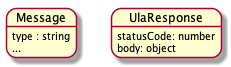
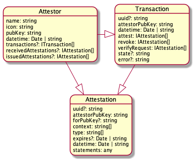

# universal-ledger-agent

[](https://travis-ci.org/rabobank-blockchain/universal-ledger-agent)
[](https://codeclimate.com/github/rabobank-blockchain/universal-ledger-agent/test_coverage)
[](https://codeclimate.com/github/rabobank-blockchain/universal-ledger-agent/maintainability)
[](https://standardjs.com)

This repository contains the Universal Ledger Agent, a TypeScript/Javascript library that acts as the main component of a plugin system that implements a message-based approach. The library can be used in browsers and Node.js backends.

## Data Models

The following common data models are exposed so that independent plugins can exchange meaningful data.

### Messaging



### Self Sovereign Identity

The ULA is primarily meant for managing Self Sovereign Identity data. A data model is provided for this purpose.
All plugins must be able to translate their own data structures back to this data model.



## Installation

In an existing project (with `package.json`), install `universal-ledger-agent`

```bash
npm install universal-ledger-agent --save
```

## Usage


### Full implementation guide (recommended)

In order to implement all available ULA plugins for the Holder in your Typescript application, please consult the [full implementation guide](docs/Integration.md).

### Initializing ULA with one plugin (example)
To illustrate the usage of the ULA we will install one Holder plugin: `ula-process-eth-barcode`. 

```bash
npm install ula-process-eth-barcode --save
```

The process-eth-barcode plugin accepts messages of which the type matches the type `ethereum-qr`. The ULA and plugin can then be used as follows:

```typescript
import { ProcessEthBarcode } from 'ula-process-eth-barcode'
import { 
  BrowserHttpService, 
  EventHandler, 
  UlaResponse 
} from 'universal-ledger-agent'

// The process-eth-barcode plugin will need a http-service to send outgoing
// messages via http. This http-service is provided by the ULA

const httpService = new BrowserHttpService()
const processEthBarCode = new ProcessEthBarcode(httpService)

// Create an array of plugins  
const plugins = [ processEthBarCode ]

// Initialize the ULA with the plugins

const eventHandler = new EventHandler(plugins)

// A QR-Code contains e.g. the following message

const message = {
  type: "ethereum-qr",
  url: "https://the.issuer.com/ssif/sesion/e6c2c3e6-33b2-471f-875d-14f18917958c"
}

// the QR-code is captured by a camera device and then offered to
// the ULA. The 'callback' mechanism is used to retrieve information
// back from the plugin (or plugins) that handled the message

eventHandler.processMsg(message, callback)

// The callback function is called with an UlaResponse parameter, but
// this callback is only used when the ula-vp-controller plugin is installed!

const callback = function(response: UlaResponse) {
	console.log('statuscode:', response.statusCode)
	console.log('body:', response.body)
}
```

### Catching errors
If one plugin throws an Error, other plugins will still continue executing their workflow.
The callback function will be triggered in case of a plugin error. Application developers must listen to these errors (example below).
We advise ULA plugin developers to provide a clear list of all Error codes and their descriptions for the application developers.

```typescript
const callback = function(response: UlaResponse) {
	// Note that it's theoretically possible that multiple errors can occur!
	console.log('statuscode:', response.statusCode) // 'error-cr'
	console.log('body:', response.body) // {}
	console.log('body:', response.error) // Error('The ChallengeRequest validation failed: Invalid signature')
	// Inform your user that the connection setup with the third party failed
}

eventHandler.processMsg(message, callback)
```

## Running tests

Besides unit testing with Mocha, the effectivity of all tests are also measured with the Stryker mutation testing framework.

```bash
npm run test
npm run stryker
```

We aim to achieve a coverage of 100%. Stryker and/or mocha test scores below 80% will fail the build.

## Credits

The ULA architecture has been designed in collaboration with Workday, Inc.

## Contributing

Pull requests are welcome. For major changes, please open an issue first to discuss what you would like to change.

Please make sure to update tests as appropriate.

## License and disclaimer

[apache-2.0](https://choosealicense.com/licenses/apache-2.0/) with a [notice](NOTICE).

We discourage the use of this work in production environments as it is in active development and not mature enough.
